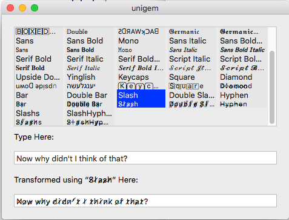

# Unigem

This repository contains **Unicode Gems**, a Mac app, an iOS app,
and an iOS keyboard that makes it easy for you to use interesting
typefaces in contexts that don't allow fonted text.

As an iOS app, you get an iPhone UI, an iPad UI, and iPad split view support.

Apple, in iOS 11, dramatically extended the character styles that you can get in their
implementation of Unicode.

Some examples:

𝐓𝐡𝐞 𝐪𝐮𝐢𝐜𝐤 𝐛𝐫𝐨𝐰𝐧 𝐟𝐨𝐱 𝐣𝐮𝐦𝐩𝐞𝐝 𝐨𝐯𝐞𝐫 𝐭𝐡𝐞 𝐥𝐚𝐳𝐲 𝐝𝐨𝐠𝐬.
𝕋𝕙𝕖 𝕢𝕦𝕚𝕔𝕜 𝕓𝕣𝕠𝕨𝕟 𝕗𝕠𝕩 𝕛𝕦𝕞𝕡𝕖𝕕 𝕠𝕧𝕖𝕣 𝕥𝕙𝕖 𝕝𝕒𝕫𝕪 𝕕𝕠𝕘𝕤.

🄽🄾🅆 🄸🅂 🅃🄷🄴 🅃🄸🄼🄴 🄵🄾🅁 🄰🄻🄻 🄶🄾🄾🄳 🄼🄴🄽 🅃🄾 🄲🄾🄼🄴 🅃🄾 🅃🄷🄴 🄰🄸🄳 🄾🄵 🅃🄷🄴🄸🅁 🄿🄰🅁🅃🅈.

𝙉𝙤𝙬 𝙞𝙨 𝙩𝙝𝙚 𝙩𝙞𝙢𝙚 𝙛𝙤𝙧 𝙖𝙡𝙡 𝙜𝙤𝙤𝙙 𝙢𝙚𝙣 𝙩𝙤 𝙘𝙤𝙢𝙚 𝙩𝙤 𝙩𝙝𝙚 𝙖𝙞𝙙 𝙤𝙛 𝙩𝙝𝙚𝙞𝙧 𝙥𝙖𝙧𝙩𝙮.

𝒥𝒶𝒸𝓀𝒹𝒶𝓌𝓈 𝓁ℴ𝓋ℯ 𝓂𝓎 𝒷𝒾ℊ 𝓈𝓅𝒽𝒾𝓃𝓍 ℴ𝒻 𝓆𝓊𝒶𝓇𝓉𝓏.

𝔍𝔞𝔠𝔨𝔡𝔞𝔴𝔰 𝔩𝔬𝔳𝔢 𝔪𝔶 𝔟𝔦𝔤 𝔰𝔭𝔥𝔦𝔫𝔵 𝔬𝔣 𝔮𝔲𝔞𝔯𝔱𝔷.

¿ʇɐɥʇ ɟo ʞuᴉɥʇ I ʇ,upᴉp ʎɥʍ ʍoN

These unicode tricks only work for the English alphabet, and some will translate to uppercase
if that is all that mode has.

Sample Mac screenshot:

Sample iPhone screenshot:

This is not an officially supported Google product.

## Using:

Select a mode and start typing. Copy from the result line into another app or use the custom
keyboard to type directly into another app.

## Caveat:

Since your text is mapped to unusual unicode values, it won't be indexed correctly by search engines. If you care,
you should repeat the text as ordinary characters in the body of your message.

## Building

1) Start by editing account.xcconfig. It currently says:

ACCOUNT=com.example

change that to your bundle prefix: the one on your developer account. Example:

ACCOUNT=com.mycompany

2) With the project 'Unigem' selected in Xcode's File Navigator, select each of the three targets and fix up the signing for your developer account. If you don't do this then you'll only able to run the Mac app, and the iOS ones in the simulator.

2.a) In the Unigem target's General section check the checkbox to turn on automatic signing and select your team.

2.b) Do the same for the 'keys' target

2.c) and again for the unigem target

3) Now you'll be able to select each of the three targets and use Xcode's Run command to run them.

4) On the iOS device, you enable a custom keyboard in Settings > General > Keyboard > Keyboards > Add New Keyboard.

PRODUCT_VERSION is a build setting defined at the project level that affects all three targets.

None of the three versions of Unigem store or send your data.

## See also:

Macintosh Unicode [Character Viewer](https://support.apple.com/kb/PH25337?locale=en_US) Part of OS X.
Click on a character to enter it in the current text edit box.

[Zalgo Text](https://www.google.com/search?q=zalgo+text) Stacking punctuation to make your text look like
something out of a Lovecraft horror novel.

